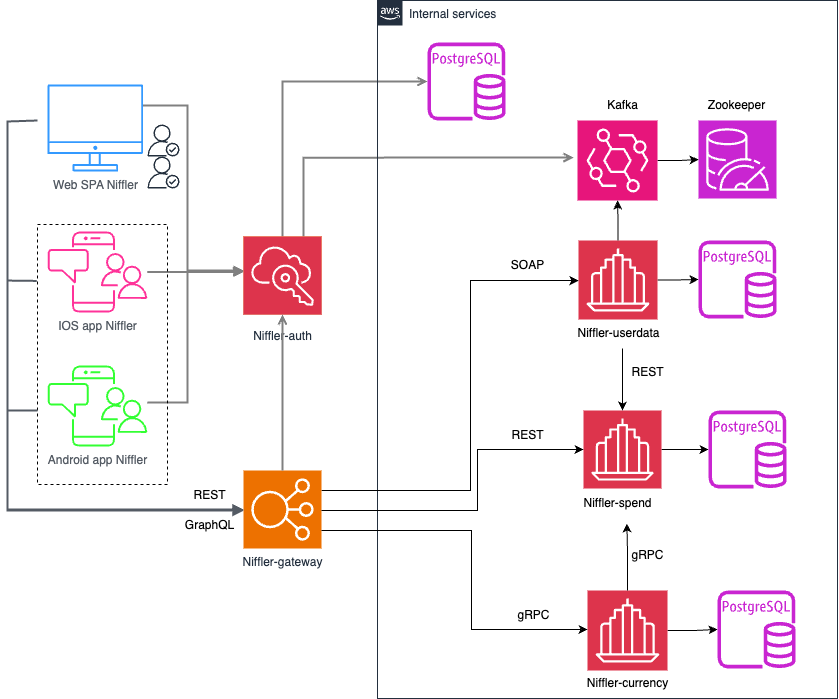

# Конфигурация для запуска

#### 1. Установить утилиту taskfile по [инструкции](https://taskfile.dev/docs/installation#homebrew) или через команду:
```posh
brew install go-task/tap/go-task
```
#### 2. В файле .env указать значение переменных окружения для Timezone, а также для имени Docker registry
#### 3. Убедиться, что порты 8089 8090 8091 8092 8093 9000 свободны
#### 4. Убедиться, что в проекте, а также на локальной машине выбрана версия Java не ниже 21
#### 5. Убедиться, что на локальной машине имеется пакетный менеджер npm не ниже 22.6.0

UPD: Timezone Пока работает только UTC

# Запуск Niffler локально в IDE:

#### 1. Запуск фронтенд-приложения
Доступны 2 варианта работы приложения - через REST и через GraphQL, нужно запустить один из них:

- для взаимодействия через REST API:
```posh
task front:rest
```

- для взаимодействия через GraphQL API:
```posh
task front:gql
```
Фронтенд приложение будет доступно по адресу http://localhost:3000/

#### 2. Запуск инфраструктуры - Кафка и БД Postgres

выполнить команду
```posh
task infra:up
```
Postgres DB будет запущен на порту 5432, Kafka будет запущена на порту 9092, Zookeeper на порту 2181

#### 3. Запуск микросервисов бэкенд приложения

- Прописать run конфигурацию для всех сервисов niffler-* - Active profiles local
- Поочередно запустить микросервисы 

#### 4. Остановка приложения

- Завершить терминал, в котором запущено фронтенд-приложение
- В IDE остановить запущенные микросервисы бэкенд-приложения
- Для остановки инфраструктурных сервисов выполнить команду
```posh
task infra:down
```

# Запуск Niffler в докере:

#### 1. Корректировка etc/hosts

В etc/hosts добавить строки
- frontend:  127.0.0.1 frontend.niffler.dc,
- auth:      127.0.0.1 auth.niffler.dc
- gateway:   127.0.0.1 gateway.niffler.dc

#### 2. Подготовка docker-образов фронтенд и бэкенд приложений

выполнить команду:
```posh
task app:build
```

#### 3. Запуск приложения

выполнить команду:
```posh
task app:run
```
Фронтенд приложение будет доступно по адресу http://frontend.niffler.dc

#### 4. Остановка приложения

выполнить команду:
```posh
task app:stop
```

#### 5. Альтернативный вариант запуска

Сборка и запуск приложения выполняются в рамках одной команды
```posh
task app:start
```

**Схема проекта Niffler 2.0**

